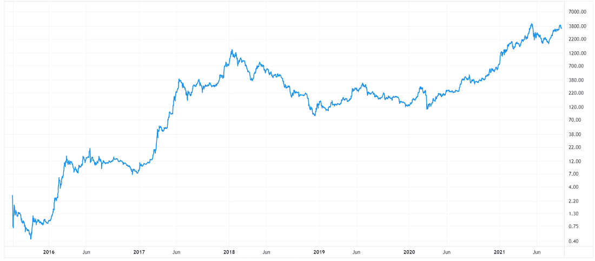

## Czym jest etherum

Projekt etherum powstał w 2013 roku za sprawą rosyjsko-kanadyjskiego programisty, Vitalika Buterina. Sieć etherum została uruchomiona w 2015 roku. Podobnie, jak Bitcoin jest kryptowalutą, jednak za nią stoi sieć, która ofreruje znacznie większe możliwości. Pozwala na tworzenie niezliczonej liczby tokenów, które także mogą być środkiem wymiany. System płatniczy jest szybszy i sprawniejszy, transakcje moga być realizowane nawet w kilkanaście sekund, jest też uważane za tańszą sieć.

## Kurs etherum

Podobnie jak bitcoin, etherum zmienia swoją wartość bardzo nagle i często. Tak samo, jak BTC, etherum zanotowało imponujący wzrost od lat 2016-17 do teraz. Jak widac na wykresie, w 2016 roku 1 ETH można było nabyć za niespełna dolara, podczas gdy raptem 5 lat później płacono za nie nawet 4000 USD.

